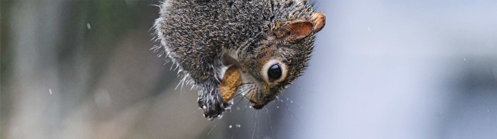

<h1>Info</h1>

<h3>Hi! I'm Junyoung 🤗</h3>
 

  
<b>Where to find me</b>

I'm member of 

Self-Driving🚕 & Embedded System Development🔌 Club

  
<b>Skills 🖥️</b>

)

  
<b>OS & Tools 🔨</b>

  
<b>Studying 📚</b>

  
<b>Stats</b>

<!-- Image by <a href="https://pixabay.com/users/gagnonm1993-4710127/?utm_source=link-attribution&amp;utm_medium=referral&amp;utm_campaign=image&amp;utm_content=2358911">gagnonm1993</a> from <a href="https://pixabay.com/?utm_source=link-attribution&amp;utm_medium=referral&amp;utm_campaign=image&amp;utm_content=2358911">Pixabay</a> -->

